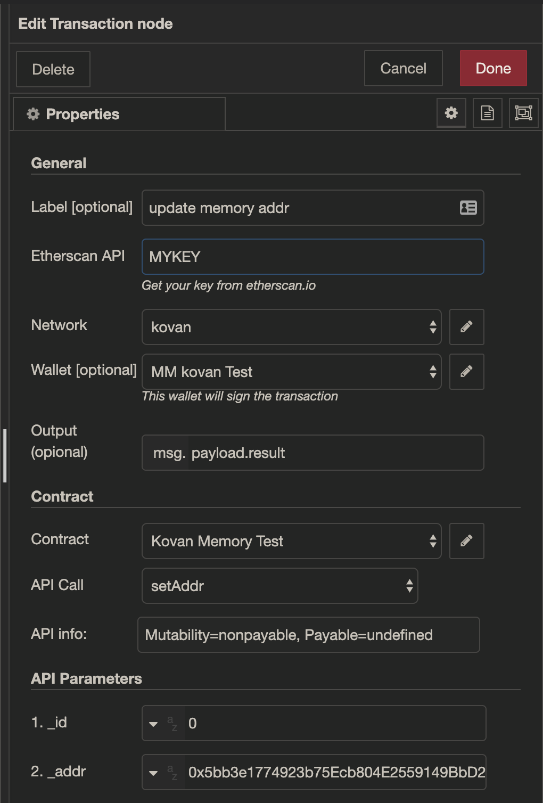

# Node-RED Etherium Transaction Node

This provides a Ethers contract transaction node that uses Ethers.js and Etherscan to automatically fetch the contract method list and method parameters.

It requires a valid Etherscan API key to auto populate the node's configuration panel.



## Quick Start

In your node-red project directory for your flow, run:
```bash
npm install node-red-contrib-ethers
```

Note: You will need an Etherscan API key to properly configure the Transaction node for fetching contract interfaces.

Restart `node-red` and use the Transaction node under the Ethers category.

## Authors

This project is a creation of [Abridged](http://www.Abridged.io)

- Jonathan Dunlap [@jadbox](https://twitter.com/jadbox) | [jdunlap.eth](https://3box.io/0xffadc07f1bfb127f4312e8652fe94ab0c771b54d)